# Prototype Level
This is a level broken down into several different regions with different purposes.

# Concept Image
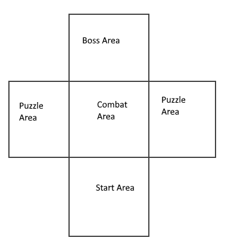

There are puzzle sections, combat sections and a platforming section.

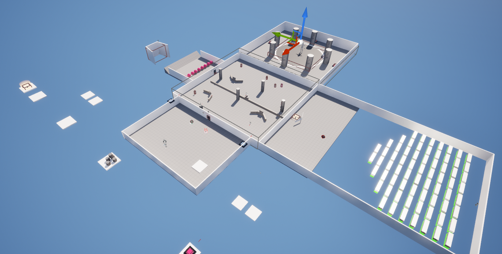

## Intention
* Give the player several objectives
* Give the player checkpoints
* Introduce some challenges for the player to overcome.

### Deisgn
A greybox map with clear intentions. There are objective indicators with instructions on how to proceed.

### How to Win
Clear the level. The objectives need to be tackled in a certain order but level design and layout make it difficult to progress before intended. There is also an objective manager in use as a fallback.

### How to Lose
For the purposes of demonstration there is no real way to "lose", if the player falls out of the level or runs out of health, they are teleported back to their last activated checkpoint.

## Areas
### Map
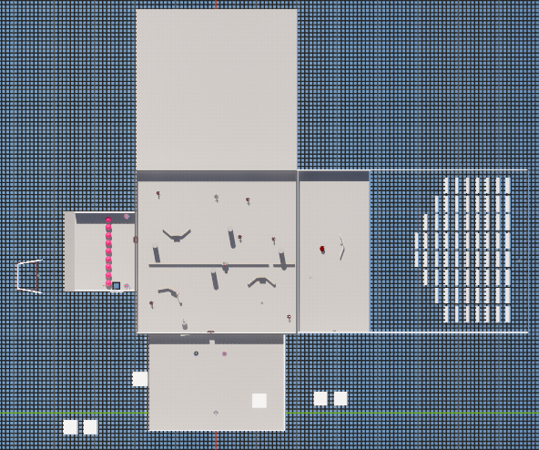

--- 

### Platform Area
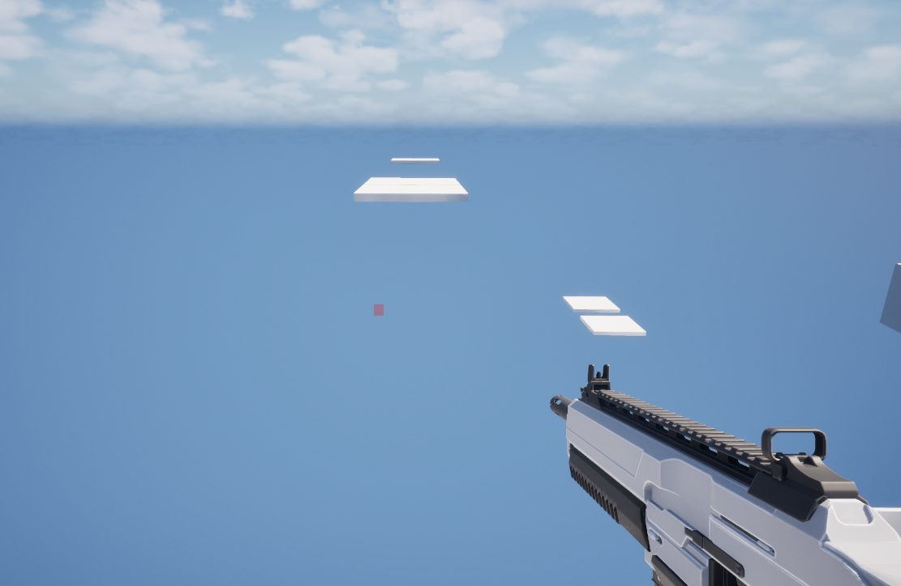

This involved some tricky platforming where the way forward may not be so obvious. There is a switch at the end of the section that will allow the door to be opened so that the player can progress.

---
### Combat Area
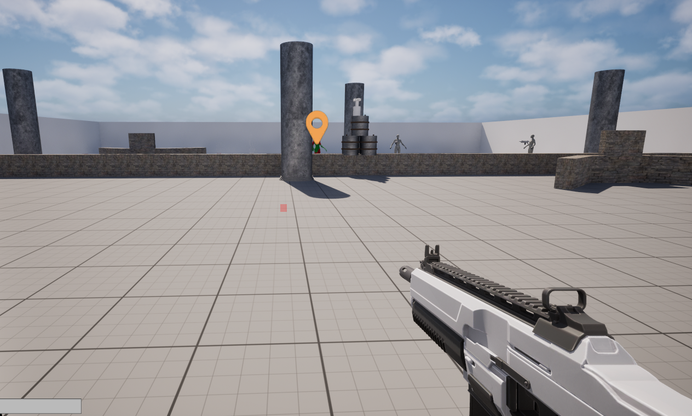

There are several different enemy types here that will attack the player. There are stationary turrets that can see or hear the player, enemies that will charge at the plater and enemies that will shoot. There is also a character marked as the objective but he may be difficult to hit due to his speed and unpredictable movement pattern.

---
### Football Area
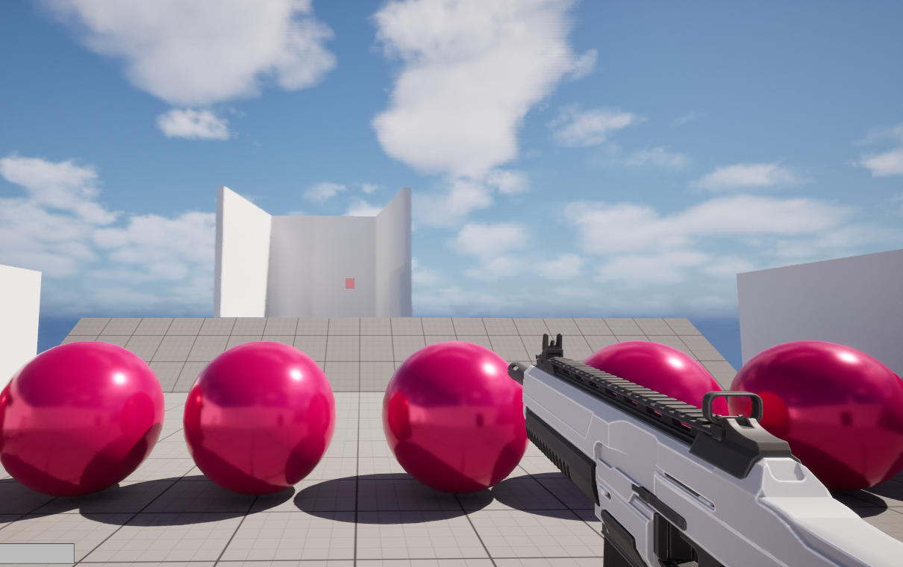

This area is like scoring goals. There are balls on the ground that can be shot at or walked into to send them flying out of the area and towards the floating 'goal'. The amount needed is five, but this might change on iteration, see below for more details on this. There is a moving platform that will spawn more balls should the player run out.

---
### Breakout Area
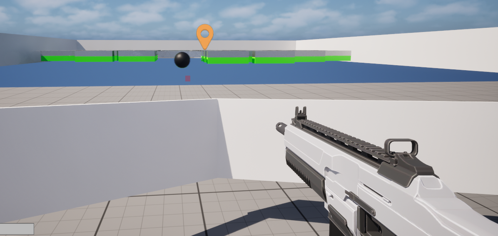

This area is an approximation of a 3D breakout game. On arrival, the player can attach to a paddle that will repel the ball towards the bricks. The player needs to clear the playing field of all the bricks to progress. Upon completion, the game will advance and the paddle will be removed from the player.

There is a large hole in this area to prevent the player from accessing the bricks which are considered out of play bounds but the player will be teleported back to the area if they are to fall.

---

### Boss Area
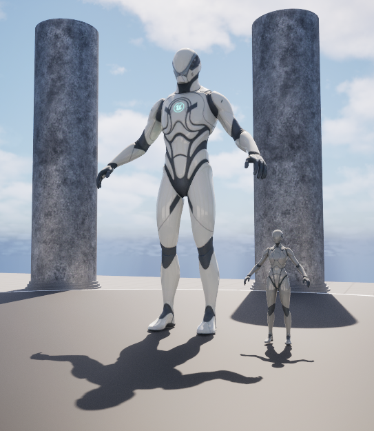

This is where the boss lurks waiting for the player. There are pillars to hide in as well as a method to apply greater damage to the boss.

This area also has additional functionality: there are three pressure plates, and when they're stepped on they'll start a chain in the BP_DangerFloor blueprint. When all three are stepped on, the floor will change colour and apply damage to the boss character. This is not specific to the boss, and the player can be hurt if they are careless.

## AI
### Enemies
#### Vision Turret
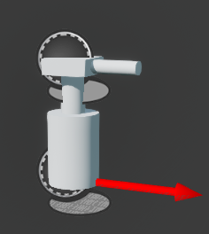

This turret uses vision based pawn sensing and will fire when it detects the player. It can rotate to keep track of the player but has short range so it can't shoot very far.

#### Sound Turret
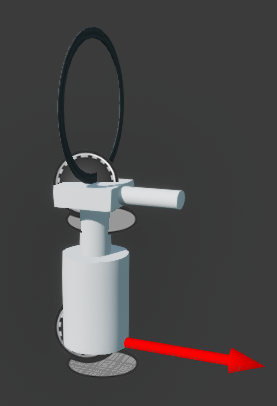

This turret uses sound based pawn sensing and will fire when it hears the player. The player can make noise by shooting, jumping, or by pressing the 'F' key to shout. This was mostly for testing purposes and will most likely be removed from the final build.

The turret will only fire for a brief time and does not track or chase the player.

#### Chase Enemy
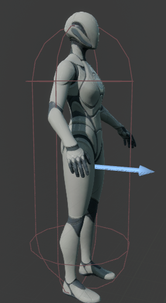

These use vision based pawn sensing and will charge the player on detection and deal damage. They well either destroy themselves or respawn depending on the setting, they're instance editable.

#### Shoot Enemy

Like above, they behave in a similar manner but will shoot the player while chasing them and will not self destruct like the Chase Enemy.

#### Enemo
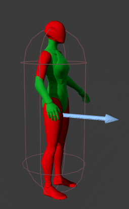

This actor will run around quickly and unpredictably. It does not fight back but it will drop a key when it's destroyed.

#### Boss

This character uses AI Perception instead of pawn sensing due to his size and functionality. He will detect the player based on vision. If he loses the player, he will return to his spawn point and begin spinning, looking for the player.

### Other

#### Friendo
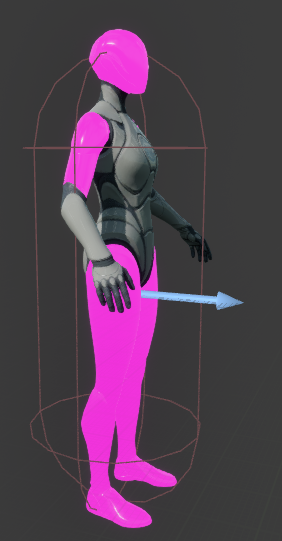

This actor is not an enemy. It will wander around aimlessly and drop a health pickup when it senses the player using vision based pawn sensing. This actor can be destroyed permanently, possibly removing the chance of getting the pickup. There is only one pickup available.

#### Health Shrine
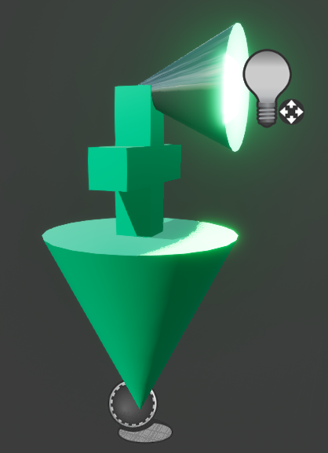

This rotates slowly and the vision based pawn sensing rotates with it. It will slowly heal the player when they get close enough to the small vision cone.

---

## Pickups
#### Health Pickup
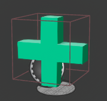

This will heal the player by 50 points. Instance editable and can be changed.

#### Assault Rifle
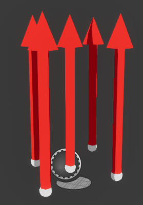

This allows the player to switch to the assault rifle, and the ammo pickup provides 30 rounds of ammunition.

#### Pistol
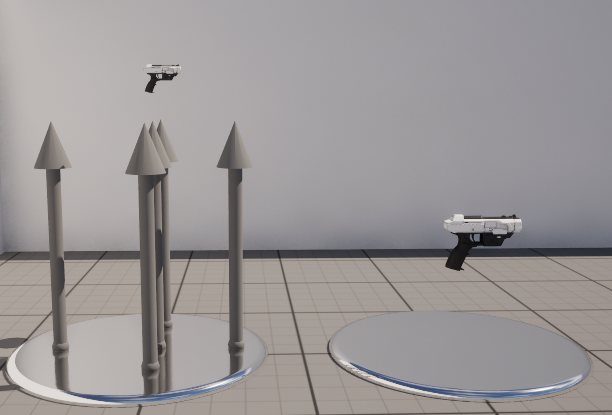

This allows the player to switch to the pistol, and the ammo pickup provides 12 rounds of ammunition.

#### Key
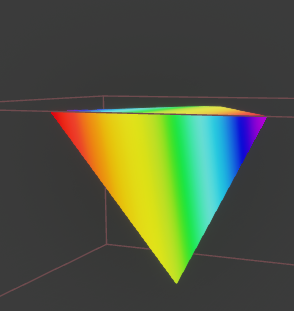

Will allow one type of door to open. 

## Other Objects

--

## Iterative Changes
* The football area proved to take longer than intended so the amount of initial balls was changed from four to nine.
* Several users stated that the platform section was too long and challenging, so some platforms were slowed down, there is now a checkpoint, and the player will teleport either to this checkpoint or to the start if fell out of the level, as opposed to dying.
* There is a very easy bypass for the platform section - jump on the wall and then onto the switch. The wall was moved further away to make this impossible.
* This only resolved half the issue, the player could just stay on the wall and leave the area. This was fixed by adding walls that appear when the player approaches, letting them think that they have broken the game.

* The BP_Friendo was changed from having the BP_HealthPickup Item to an instance editable variable to prevent the BP_Enemo child from also spawning this item.
* The BP_ShootEnemy had its vision angle and distance reduced to prevent the bug causing it to fire straight ahead constantly. This is generally outside the bounds of play and shouldn't be exploitable by players anyway.
* The ammo pickups used to allow the player to bypass the maximum ammo amount. This was resolved with a clamp in the ammo pickup blueprint.
* The BP_BossPlates used to allow a player to step on one repeatedly to achieve the intended effect, this was fixed by disabling collision when one is stepped on.

### Future Changes
* ~~The walls still allow the player to bypass the platform area. This won't update the objective manager and will cause a softlock.~~

### Bugs Encountered
* ~~The BP_Enemo is a child of BP_Friendo and will drop a health pickup when encountered.~~
* ~~The Ammo pickup will allow the Reserve Ammo to go above 90.~~
* ~~The BP_ShootEnemy will fire straight ahead if it detects a player outside of the Navmesh area.~~
* ~~The BP_BossPlates can be stepped on repeatedly, having the same effect as stepping in all three.~~

## Works Referenced
* https://mammothclub.com/
* https://www.youtube.com/@FcbDev
* https://www.youtube.com/@TinkrAcademy
* https://www.youtube.com/@SmartPoly
* https://www.youtube.com/@InfimaGames
* Official Unreal Engine Documentation

No external assets were used. Anything outside of the default First Person Shooter assets are my own creation.